# FOC CA2 Assignment Documentation
## **Tasks: 6, 7 and 8** 

Before doing anything, make sure you are running the latest version of ubuntu, use:  
```
sudo apt-get update
sudo apt-get upgrade
``` 

### Backing up the server files (Task 6)  

**To backup the wordpress website**
For this, I have made a script which tars the entire directory where the wordpress is stored.

First create a new dir in your home, I called mine backup_wordpress.

The command is,
```
sudo mkdir backup_wordpress
```

Then I made a script file, called get_backup.sh, and did the following commands,

```
touch get_backup.sh 
sudo chown root:SysAdmin get_backup.sh
sudo chmod 771 get_backup.sh
sudo vi get_backup.sh
```

Once you sudo vi into the file, you should write this,

```
tar -cvzf wordpress_backup.tar.gz /var/www/html/p1922264/;
~ 
~
~
~
~
~
~
~
~
~
~
~
~
~
~
~
~
~
~
~
~
```

Once you are done, to run the script use,

```
./get_backup.sh
```

and you should see this, note your `p1922264` should be your `admin_number`

```
p1922264@p1922264:~/backup_wordpress$ ls
get_back_up.sh  wordpress_backup.tar.gz
p1922264@p1922264:~/backup_wordpress$
```

**To backup your ubuntu server**
First shutdown your ubuntu instance and right click on it to clone,

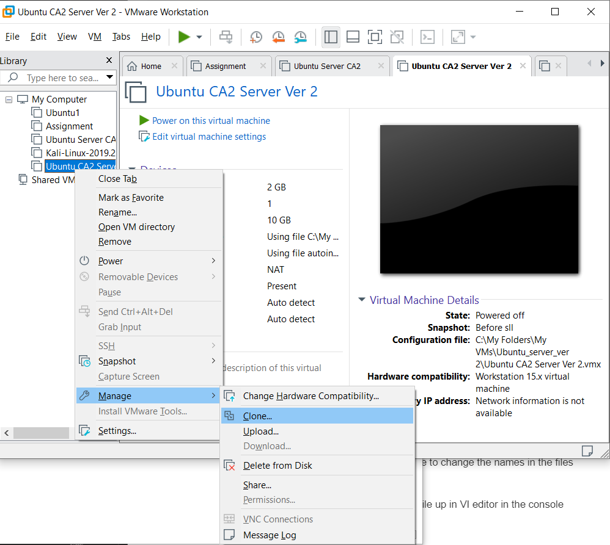  

Then follow this series of steps,

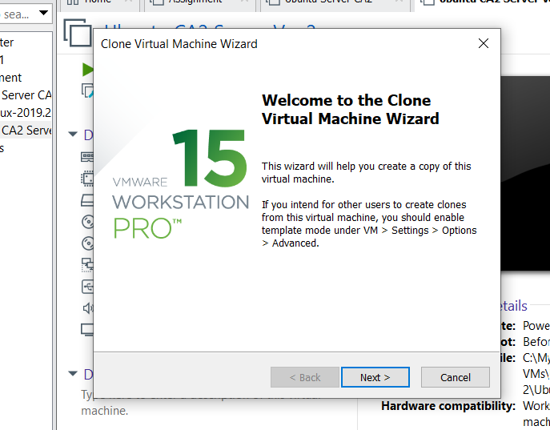  

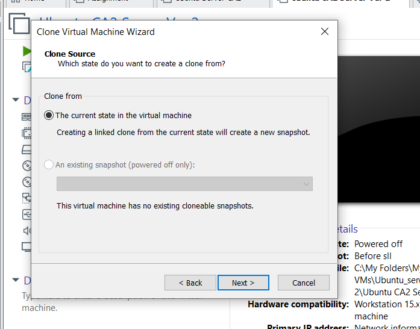  

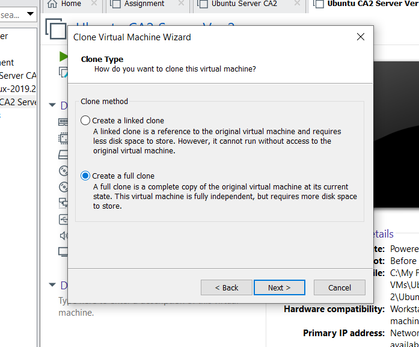  

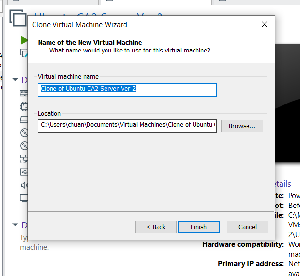  

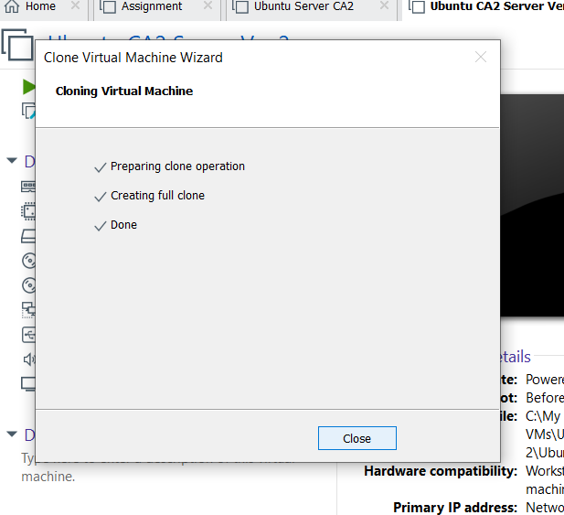  

Then you should see a backup in the directory in where you specified. 

---

###Register an account in AWS and Provision an Ubuntu 18 virtual machine <br> You should be able to SSH to the instance (Task 7 and 8)

### 1. Create a new Virtual instance for assignment

For local VM's:
hostname: p*******  
Where p******** is your student admission number  

How to Setup:  
After setting up a VM with Ubuntu Server 18.06 LTS

To Check hostname: `hostname`  
It should show something like this,
```
p1922264@p1922264:~$ hostname
p1922264
p1922264@p1922264:~$
```

If the hostname shown is not the prefered hostname you have to change the names in the files /etc/hosts and /etc/hostname

You can use the commands `sudo vi file_path` to open the file up in VI editor in the console

For /etc/hosts: 
```
127.0.0.1       localhost.localdomain   localhost
::1             localhost6.localdomain6 localhost6
127.0.0.1       your_desired_name
# The following lines are desirable for IPv6 capable hosts
::1     localhost ip6-localhost ip6-loopback
fe00::0 ip6-localnet
ff02::1 ip6-allnodes
ff02::2 ip6-allrouters
ff02::3 ip6-allhosts
```

For /etc/hostname:
```
your_host_name
```
---

For the AWS instance,
To create an instance, go to the AWS console and go to the EC2 instance

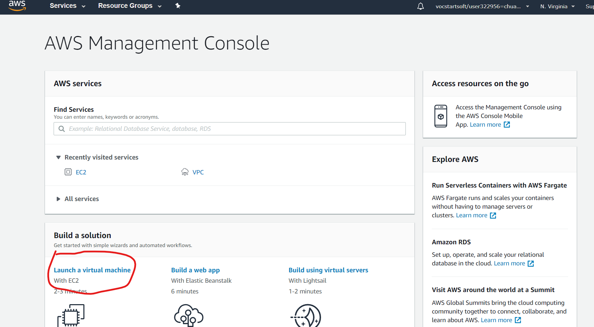  

Once in, search for ubuntu and use an ubuntu 18.04 instance
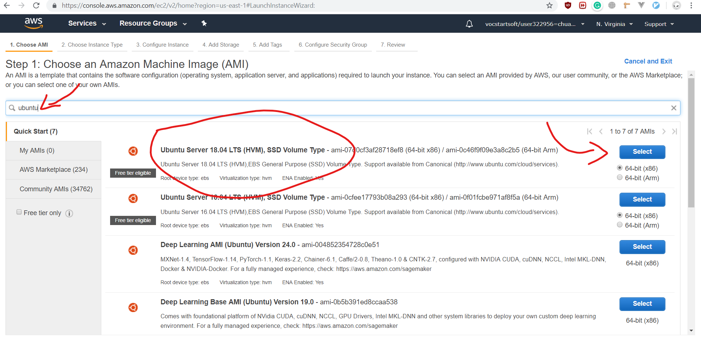  

Make sure you pick the free tier avaliable and review and launch the instance
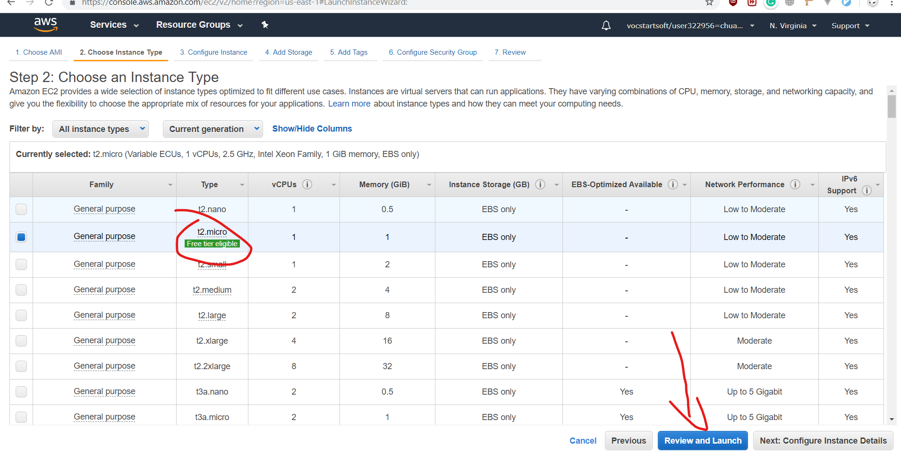  

Launch the Instance
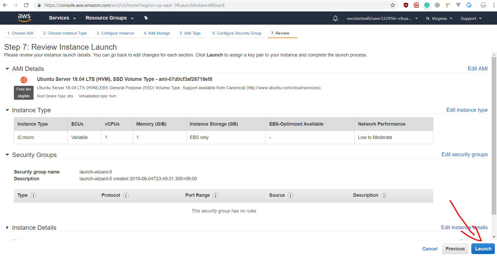  

Then create your own private key, with your own name.  
Make sure to download it as well.
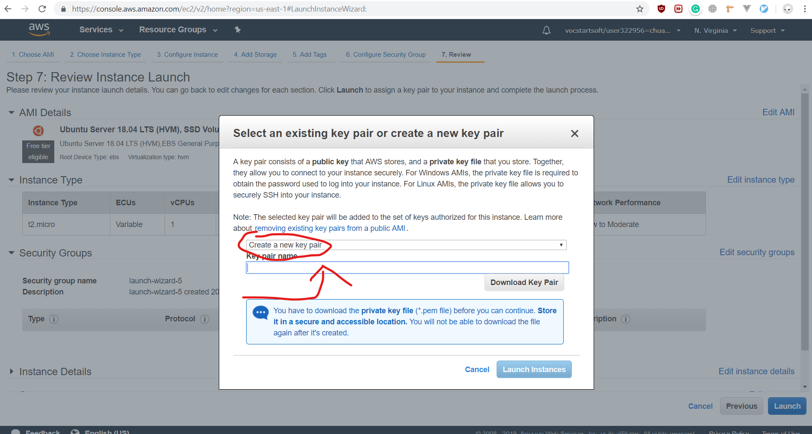  

After Downloading you should get this file,  
Note the name of your key should be here.


Then you should use puttygen to generate the putty key,
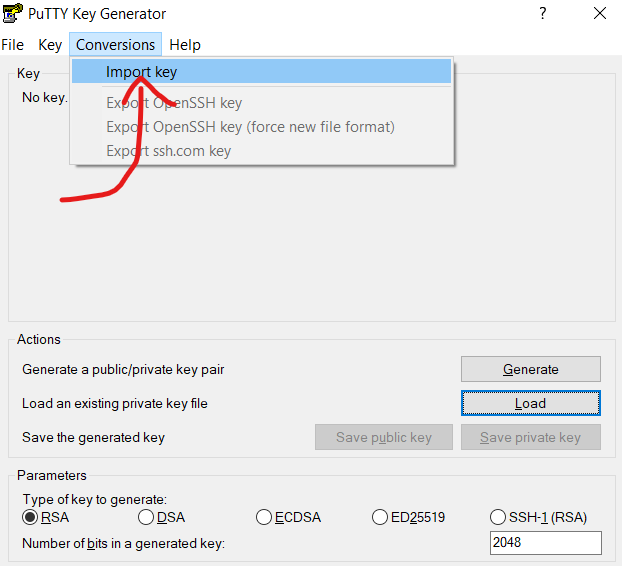  

Then save the key as a putty key, keeping in mind to add a password/paraphrase
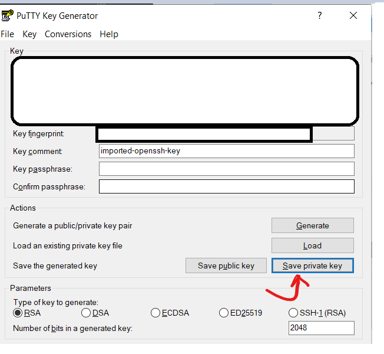

Then you can use putty to connect,
Make sure in the Hostname section, put `ubuntu@your_public_ip`
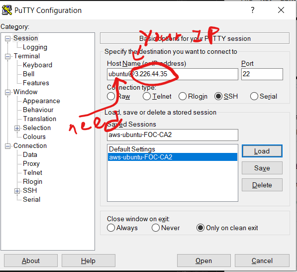  

Then make sure you load in your putty key,
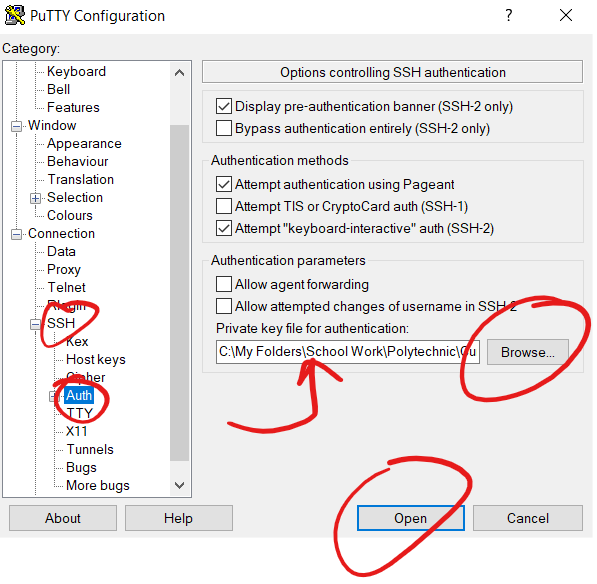  

Then you can ssh into your ubuntu server,
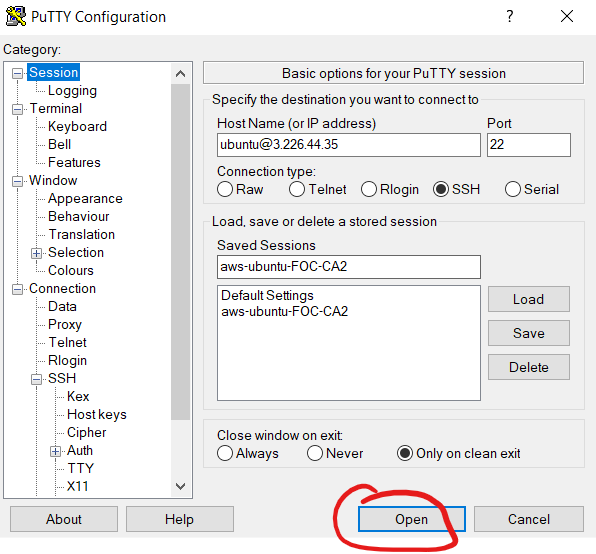  


### 2. Install Apache web server, PHP and Mysql server

To install apache2:
```
sudo apt-get install apache2
```

To install php, use the command:  
```
sudo apt install php7.2 php7.2-cli php7.2-mysql php7.2-json
php7.2-opcache php7.2-mbstring php7.2-xml php7.2-gd php7.2-curl
```

To install MySQL, use the command:  
```
sudo apt-get install myql-server
sudo mysql_secure_installation
```

After the 2nd step, make sure to set your password for the root user and then accept defaults for the other settings(Just say Yes).

This is what you should see:  
Ignore the first partas I already have a password set up
```
Securing the MySQL server deployment.
Enter password for user root:
The 'validate_password' plugin is installed on the server.
The subsequent steps will run with the existing configuration
of the plugin.
Using existing password for root.
Estimated strength of the password: 50
Change the password for root ? ((Press y|Y for Yes, any other key for No) : n
... skipping.
By default, a MySQL installation has an anonymous user,
allowing anyone to log into MySQL without having to have
a user account created for them. This is intended only for
testing, and to make the installation go a bit smoother.
You should remove them before moving into a production
environment.
Remove anonymous users? (Press y|Y for Yes, any other key for No) :
... skipping.
Normally, root should only be allowed to connect from
'localhost'. This ensures that someone cannot guess at
the root password from the network.
Disallow root login remotely? (Press y|Y for Yes, any other key for No) :
... skipping.
By default, MySQL comes with a database named 'test' that
anyone can access. This is also intended only for testing,
and should be removed before moving into a production
environment.
Remove test database and access to it? (Press y|Y for Yes, any other key for No) :
... skipping.
Reloading the privilege tables will ensure that all changes
made so far will take effect immediately.
Reload privilege tables now? (Press y|Y for Yes, any other key for No) :
... skipping.
All done! 
```

We will continue the mysql set-up in part 4

**Debugging**

To check if apache is running you can do 2 things:  
1. Check using the console, run:   
```
sudo systemctl status apache2
```

The output for a running apache2 server should be: (The bullet point at the top should be green)   
```
● apache2.service - The Apache HTTP Server
   Loaded: loaded (/lib/systemd/system/apache2.service; enabled; vendor preset: enabled)
  Drop-In: /lib/systemd/system/apache2.service.d
           └─apache2-systemd.conf
   Active: active (running) since Wed 2019-07-24 12:06:49 UTC; 34min ago
  Process: 1366 ExecStop=/usr/sbin/apachectl stop (code=exited, status=0/SUCCESS)
  Process: 1371 ExecStart=/usr/sbin/apachectl start (code=exited, status=0/SUCCESS)
 Main PID: 1382 (apache2)
    Tasks: 11 (limit: 2290)
   CGroup: /system.slice/apache2.service
           ├─1382 /usr/sbin/apache2 -k start
           ├─1387 /usr/sbin/apache2 -k start
           ├─1388 /usr/sbin/apache2 -k start
           ├─1389 /usr/sbin/apache2 -k start
           ├─1391 /usr/sbin/apache2 -k start
           ├─1394 /usr/sbin/apache2 -k start
           ├─1395 /usr/sbin/apache2 -k start
           ├─1399 /usr/sbin/apache2 -k start
           ├─1400 /usr/sbin/apache2 -k start
           ├─1401 /usr/sbin/apache2 -k start
           └─1402 /usr/sbin/apache2 -k start

Jul 24 12:06:49 p1922264 systemd[1]: Starting The Apache HTTP Server...
Jul 24 12:06:49 p1922264 apachectl[1371]: AH00558: apache2: Could not reliably determine the server's fully qualified do
Jul 24 12:06:49 p1922264 systemd[1]: Started The Apache HTTP Server.
```

2. Go to firefox and key in the website: `http://127.0.0.1`  
It should show this image: //To-Do (Image of ubuntu default index page here)

To Check if PHP is successfuly installed on your server, you can check by adding a php file in your /var/www/html dir to show `php.info();`

The commands are: 
```
sudo vi /var/www/html/test.php
```

Then you will see:
```
~
~
~
~
~
~
~
~
~                                                                                               
~
~
~
~
~
~
~
~
~
~
~
~
~
~
~
~
~
~
~
"/var/www/html/test.php" [New File]
0,0-1         All 
```
Add this into the file such that it looks like this: 
```
<?php php.info(); ?>                                                                            
~
~
~
~
~
~
~
~                                                                                               
~
~
~
~
~
~
~
~
~
~
~
~
~
~
~
~
~
~
~
-- INSERT 
--1,20          All 
``` 


With this you can now got to `http://127.0.0.1/test.php` to check if you see this:  
To-Do(Add picture of php info)

---

### 3. Create Groups and Permissions

Group:   
SysAdmin(with 2 users)        Manage Ubuntu server   
SysAdminUser1 and SysAdminUser2   
WebDev(with 2 users)            Update contents for wordpress web site  
WebDevUser1 and WebDevUser2    

After you create above groups, you need to set proper permissions for group members to access the resources, using the LEAST Privilege.

For this, We will first set up the 4 users we need.  
To add a user we will use the commands:  
```
sudo adduser username_you_are_using --force-badname
```

You Should get this screen later on, use your own Full name (could be Web Devloper 1 for example),  
```
Allowing use of questionable username.
Adding user `WebDevUser1' ...
Adding new group `WebDevUser1' (1007) ...
Adding new user `WebDevUser1' (1005) with group `WebDevUser1' ...
Creating home directory `/home/WebDevUser1' ...
Copying files from `/etc/skel' ...
Enter new UNIX password:
Retype new UNIX password:
passwd: password updated successfully
Changing the user information for WebDevUser1
Enter the new value, or press ENTER for the default
Full Name []: Web Developer 1
Room Number []:
Work Phone []:
Home Phone []:
Other []:
Is the information correct? [Y/n]
```

After all 4 users are added, you can check with the command,  
```
sudo tail /etc/passwd
```

You Should see something similar to this,
```
dnsmasq:x:107:65534:dnsmasq,,,:/var/lib/misc:/usr/sbin/nologin
landscape:x:108:112::/var/lib/landscape:/usr/sbin/nologin
pollinate:x:109:1::/var/cache/pollinate:/bin/false
p1922264:x:1000:1000:p1922264:/home/p1922264:/bin/bash
sshd:x:110:65534::/run/sshd:/usr/sbin/nologin
mysql:x:111:114:MySQL Server,,,:/nonexistent:/bin/false
SysAdminUser1:x:1001:1001:SYstem Admin 1,,,:/home/SysAdminUser1:/bin/bash
SysAdminUser2:x:1002:1002:SYstem Admin 2,,,:/home/SysAdminUser2:/bin/bash
WebDevUser1:x:1003:1003:Wed Developer 1,,,:/home/WebDevUser1:/bin/bash
WebDevUser2:x:1004:1004:Web Developer 2,,,:/home/WebDevUser2:/bin/bash  
```

Now we are going to make the 2 groups by using the command,  
```
sudo addgroup group_name --force-badname
```

You wil get this response if it is successful
```
Allowing use of questionable username.
Adding group `SysAdmin' (GID 1002) ...
Done.            
```

Now you can add users to a group using this command syntax:
```
sudo usermod -aG group_name user_name
```

Now to set-up perms for the SysAdmin, we have to add the group to the sudoers file.  
We can do this by using the command,
```
sudo visudo
```

You will the see this, **(Add in the %SysAdmin line)**
```
#
# This file MUST be edited with the 'visudo' command as root.
#
# Please consider adding local content in /etc/sudoers.d/ instead of
# directly modifying this file.
#
# See the man page for details on how to write a sudoers file.
#
Defaults        env_reset
Defaults        mail_badpass
Defaults        secure_path="/usr/local/sbin:/usr/local/bin:/usr/sbin:/usr/bin$

# Host alias specification

# User alias specification

# Cmnd alias specification

# User privilege specification
root    ALL=(ALL:ALL) ALL

# Members of the admin group may gain root privileges
%admin ALL=(ALL) ALL

# Allow members of group sudo to execute any command
%sudo   ALL=(ALL:ALL) ALL

# Allow members of group SysAdmin to exectue any Command
%SysAdmin ALL=(ALL:ALL) ALL

# See sudoers(5) for more information on "#include" directives:

#includedir /etc/sudoers.d

```

We will continue to set-up the perms later on in step 4(next step).

---

### 4. Install, Configure and Monitor Wordpress web site

For this make sure you are in your home dir of your account.  

You can check by using,
```
cd
pwd
```
You shoud see(For a system user):
```
/home/user_name
```

or for root,

```
/root
```

Now we will be downloading the latest tar package or wordpress,
```
wget https://wordpress.org/latest.tar.gz
tar -xzvf latest.tar.gz
ls
```

You should now see this: 
```
latest.tar.gz  wordpress
```

Now we will be setting up MySQL for the wordpress.
We will now login to MySQL using,
```
sudo mysql
```

To change the password for the root user we can use:  
```
ALTER USER 'root'@'localhost' IDENTIFIED WITH mysql_native_password BY 'your_password_here';
```

To check for the list of users:
```
SELECT user,authentication_string,plugin,host FROM mysql.user;
```

To create a wordpress-user, do
```
CREATE USER 'wordpress-user-your_admin_id'@'localhost' IDENTIFIED BY 'your_strong_password';
```

To create the wordpress database, do  
```
CREATE DATABASE `wordpress-db-your_admin_id`;
```

To grant perms for the user onto the database,
```
GRANT ALL PRIVILEGES ON `wordpress-db-your_admin_id`.* TO "wordpress-user-your_admin_id"@"localhost";
```

To exit MySQL,  
```
exit;
```

Now back to setting up wordpress,  
Go back to your home dir with the wordpress file,  
then run the commands,
```
cp wp-config-sample.php wp-config.php
vi wp-config.php
```

You will see this:  
Things to note,
Please change the DB_NAME, DB_USER AND DB_PASSWORD
The pick a salt from this website [link](https://api.wordpress.org/secret-key/1.1/salt/)
```
<?php
/**
* The base configuration for WordPress
*
* The wp-config.php creation script uses this file during the
* installation. You don't have to use the web site, you can
* copy this file to "wp-config.php" and fill in the values.
*
* This file contains the following configurations:
*
* * MySQL settings
* * Secret keys
* * Database table prefix
* * ABSPATH
*
* @link https://codex.wordpress.org/Editing_wp-config.php
*
* @package WordPress
*/
// ** MySQL settings - You can get this info from your web host ** //
/** The name of the database for WordPress */
define( 'DB_NAME', 'wordpress-db-your_admin_id' );
/** MySQL database username */
define( 'DB_USER', 'wordpress-user-your_admin_id' );
/** MySQL database password */
define( 'DB_PASSWORD', 'your_password' );   
/** MySQL hostname */
define( 'DB_HOST', 'localhost' );
/** Database Charset to use in creating database tables. */
define( 'DB_CHARSET', 'utf8' );
/** The Database Collate type. Don't change this if in doubt. */
define( 'DB_COLLATE', '' );
define( 'FS_METHOD', 'direct');
/**#@+
* Authentication Unique Keys and Salts.
*
* Change these to different unique phrases!
* You can generate these using the {@link https://api.wordpress.org/secret-key/1.1/salt/ WordPress.org secret-key service}
* You can change these at any point in time to invalidate all existing cookies. This will force all users to have to log in again.
*
* @since 2.6.0
*/
define('AUTH_KEY',         '');
define('SECURE_AUTH_KEY',  '');
define('LOGGED_IN_KEY',    '');
define('NONCE_KEY',        '');
define('AUTH_SALT',        '');
define('SECURE_AUTH_SALT', '');
define('LOGGED_IN_SALT',   '');
define('NONCE_SALT',       '');
/**#@-*/
/**
* WordPress Database Table prefix.
*
* You can have multiple installations in one database if you give each
* a unique prefix. Only numbers, letters, and underscores please!
*/
$table_prefix = 'wp_';
/**
* For developers: WordPress debugging mode.
*
* Change this to true to enable the display of notices during development.
* It is strongly recommended that plugin and theme developers use WP_DEBUG
* in their development environments.
*
* For information on other constants that can be used for debugging,
* visit the Codex.
*
* @link https://codex.wordpress.org/Debugging_in_WordPress
*/
define( 'WP_DEBUG', false );
/* That's all, stop editing! Happy publishing. */

/** Absolute path to the WordPress directory. */
if ( ! defined( 'ABSPATH' ) ) {
        define( 'ABSPATH', dirname( __FILE__ ) . '/' );
        }
/** Sets up WordPress vars and included files. */
require_once( ABSPATH . 'wp-settings.php' );                                                                            
```

After you are done, copy the files over to the the dir in /var/www/html/your_admin_id,
```
sudo mkdir /var/www/html/your_admin_id
sudo cp -r wordpress/* /var/www/html/your_admin_id
```

Then access the wordpress site from your browser using, `http://127.0.0.1/p1922264`

Now we will be setting up the group permssions for the WebDev group.
First we will be setting the whole dir of /var/www/html to owner and group to be www-data
```
sudo chown -R www-data /var/www/
sudo chgrp -R www-data /var/www
```

The change the modes for owner, groups and others using,
```
sudo chgrp -R WebDev /var/www/
find /var/www -type d -exec chmod 2770 {} \;
find /var/www -type f -exec chmod 0660 {} \;
```

---


